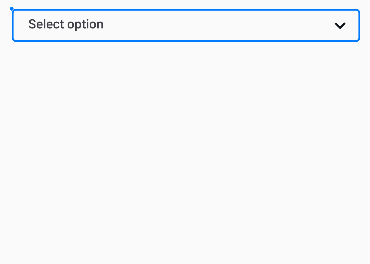
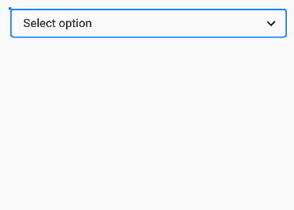

|                                                                                                                                                        |                                                                                                                                                                                                           |                                                                                                                                                                                                                             |                                                                                                                                                    |                                                                                                                                                                                    |
|--------------------------------------------------------------------------------------------------------------------------------------------------------|-----------------------------------------------------------------------------------------------------------------------------------------------------------------------------------------------------------|-----------------------------------------------------------------------------------------------------------------------------------------------------------------------------------------------------------------------------|----------------------------------------------------------------------------------------------------------------------------------------------------|------------------------------------------------------------------------------------------------------------------------------------------------------------------------------------|
| <a href="https://www.npmjs.com/package/expo-select-dropdown"></a> | <a href="https://www.npmjs.com/package/expo-select-dropdown"></a> | <a href="https://github.com/danish1658/react-native-dropdown-select-list/stargazers"></a> | <a href="https://www.npmjs.com/package/expo-select-dropdown"></a> | <a href="https://www.npmjs.com/package/expo-select-dropdown"></a> |

<h1 align="center">
Expo / React Native Select Dropdown
</h1>

<h3>Installation</h3>
```shell
  npm install expo-select-dropdown
```
OR
```shell
    yarn add expo-select-dropdown
```

<h4> Dependencies </h4>
This package depends on the following packages:
- @expo/vector-icons


<h2>Example</h2>

| Without Filters  | With Fitlers             |
|------------------|--------------------------|
|  |  |

<h2>Usage</h2>

```tsx
    import {SelectDropdown, DropdownData} from "expo-select-dropdown";
    
    export default function App() {  
     const [selected, setSelected] = useState<DropdownData<string, string> | null>(null);  
     const [data] = useState<DropdownData<string, string>[]>([  
          {key: "1", value: "Toothbrush"}, 
          {key: "2", value: "Laptop"}, 
          {key: "3", value: "Sunglasses"},  
	      {key: "4", value: "Baseball"}, 
	      {key: "5", value: "Scissors"}, 
	      {key: "6", value: "Bicycle"},  
	      {key: "7", value: "Camera"}, 
	      {key: "8", value: "Umbrella"}, 
	      {key: "9", value: "Backpack"},  
	      {key: "10", value: "Water bottle"}  
     ]);
       
     return (  
          <SelectDropdown  
		      data={data}  
              placeholder={"Select option"}  
              selected={selected}  
              setSelected={setSelected}  
              searchOptions={{cursorColor: "#007bff"}}  
              searchBoxStyles={{borderColor: "#007bff"}}  
              dropdownStyles={{borderColor: "#007bff"}}  
          />  
      );  
    }
```

<h2>Filter Usage</h2>

```tsx
export default function App() {
    const [selected, setSelected] = useState<DropdownData<string, string> | null>(null);
    const data = [
        {key: "1", value: "Toothbrush", location: "Bathroom", date: "2021-05-01", time: "12:00"},
        {key: "2", value: "Laptop", location: "Bathroom", date: "2021-05-01", time: "12:00"},
        {key: "3", value: "Sunglasses", location: "Bedroom", date: "2021-05-01", time: "12:00"},
        {key: "4", value: "Baseball", location: "Bathroom", date: "2021-05-01", time: "12:00"},
        {key: "5", value: "Scissors", location: "Bedroom", date: "2021-06-01", time: "1:00"},
        {key: "6", value: "Bicycle", location: "Bedroom", date: "2021-05-01", time: "12:00"},
        {key: "7", value: "Camera", location: "Bathroom", date: "2021-06-01", time: "1:00"},
        {key: "8", value: "Umbrella", location: "Bedroom", date: "2021-06-01", time: "12:00"},
        {key: "9", value: "Backpack", location: "Bathroom", date: "2021-05-01", time: "1:00"},
        {key: "10", value: "Water bottle", location: "Bedroom", date: "2021-06-01", time: "12:00"},
    ]
    const [tags] = useState<TagData[]>([
        {key: "1", name: "Location", onFilter: () => {
            return data.filter((item) => item.location.toLowerCase().includes("Bathroom".toLowerCase()));
        }},
        {key: "2", name: "Date", onFilter: () => {
            return data.filter((item) => item.date.toLowerCase().includes("2021-05-01".toLowerCase()));
        }},
        {key: "3", name: "Time", onFilter: () => {
            return data.filter((item) => item.time.toLowerCase().includes("12:00".toLowerCase()));
        }}
    ])

    return (
        <View style={styles.container}>
            <SelectDropdown
                data={data.map((item) => {return {key: item.key, value: item.value}})}
                tags={tags}
                placeholder={"Select option"}
                selected={selected}
                setSelected={setSelected}
                searchOptions={{cursorColor: "#007bff"}}
                searchBoxStyles={{borderColor: "#007bff"}}
                dropdownStyles={{borderColor: "#007bff"}}
            />
        </View>
    );
}
```

<h2>SelectDropdownProps</h2>

```ts
interface SelectDropdownProps {  
    data: DropdownData<any, any>[]  
    placeholder: string  
    selected: DropdownData<any, any> | null  
    setSelected: (selected: DropdownData<any, any>) => void
    tags?: TagData[]
    searchOptions?: TextInputProps  
    searchBoxStyles?: ViewStyle  
    dropdownStyles?: ViewStyle
}
```

<h2>TagData</h2>

```ts
interface TagData {
    key: any;
    name: string;
    onFilter: () => DropdownData<any, any>[] | undefined;
}
```


**Work In Progress**
- [x] Filter option added for searching items (optional)
- [x]  Tags for the filters
- [x] Improved default styling
- [ ] Restrict breaking styling options
- [ ] Make search setting optional
- [ ] Dependency clean up

